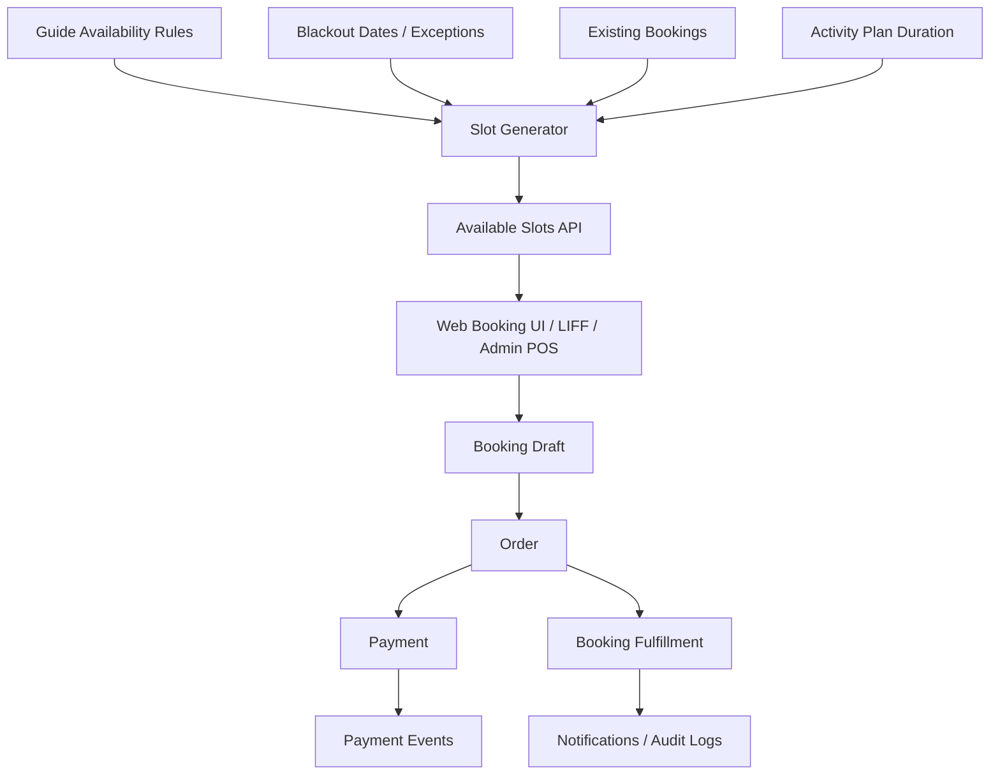
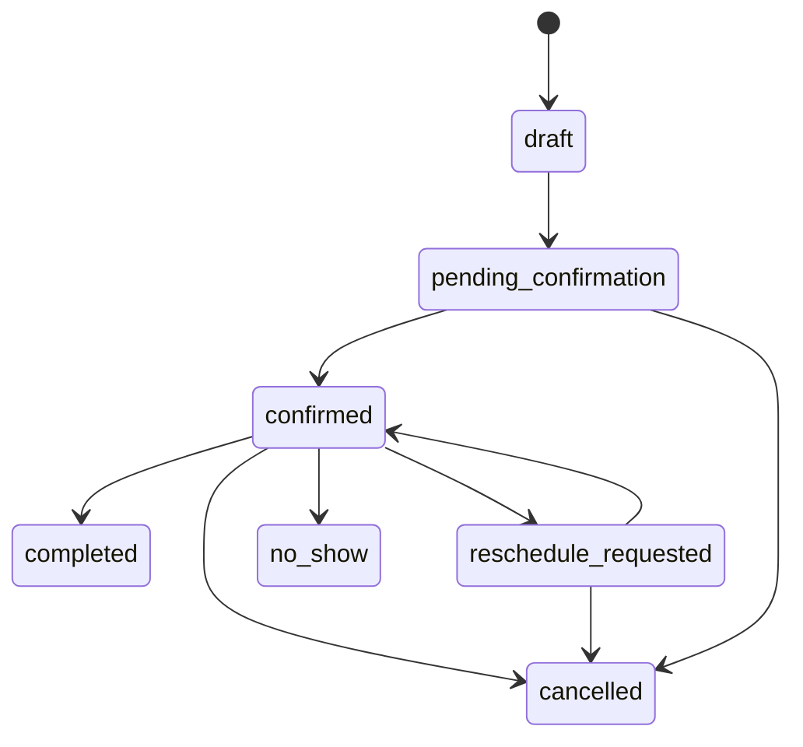

# Tour Platform 預約系統 + POS 改善方案

> 目的：基於現有 Tour Platform（Next.js + Supabase + TypeScript），定義下一階段的預約核心架構、POS 最小閉環、API 設計、資料模型，以及可直接參考/改寫的成熟開源代碼來源。
> 
> 核心原則：**不要重造輪子，但也不要把巨獸整套搬進來。**
> 
> 參考方向：
> - 預約端：**Cal.com 的 availability / slot generation / booking state machine**
> - POS 端：**ERPNext 的 order → item → payment 結構與 cashier workflow**
> 
> 更新日期：2026-04-09

---

## 0. 結論先行

### 我們該怎麼做

1. **預約核心不要自己從零發明**
   - 直接參考 **Cal.com** 的「Availability + Slot Generation + Booking」資料模型與演算法思路。
   - 我們不需要照抄整個產品，只要抄這三塊：
     - 可用時間定義方式
     - slot 產生規則
     - booking 狀態機

2. **POS 不要引入完整 ERP**
   - 直接在 Supabase 裡建立簡化版：
     - `orders`
     - `order_items`
     - `payments`
     - `payment_events`
   - 目標不是做 ERP，而是讓現場或客服能快速建單、收款、補款、記錄例外。

3. **最重要的不是 UI，而是狀態設計**
   - 現有 `activity_schedules` 偏「靜態場次」；下一階段要支援更彈性的 availability。
   - 訂單狀態、預約狀態、付款狀態必須拆清楚，否則之後 LINE、POS、退款、改期一定爆炸。

4. **有一部分代碼可以大幅照抄，但不是整個 repo**
   - **最值得抄的：Cal.com 的 availability / slots / booking status 思維與 server-side flow**
   - **次值得抄的：ERPNext 的 sales order / payment entry / POS invoice 結構概念**
   - **不建議直接抄的：整套 UI、整套 ACL、整套 ERP / multi-tenant / plugin system**

---

## 1. 現況診斷：目前 Tour Platform 的結構問題

根據現有文件：
- `activities`
- `activity_schedules`
- `orders`
- `payments`

這組結構可以支撐 MVP，但有三個瓶頸：

### 1.1 預約模型過度依賴 `activity_schedules`
目前是先建立固定場次，再讓用戶選購。

這個做法適合：
- 固定日期團
- 固定場次團
- 人工營運可控的少量 SKU

但不適合：
- 導遊有規律班表（例如每週二、四、六可接單）
- 客製化半日 / 一日遊
- 動態時長
- LINE 對話式 / LIFF 即時選時段
- 改期、插單、私人包團

### 1.2 訂單狀態承擔太多責任
目前 `orders.status` 同時混合了：
- 預約狀態
- 付款狀態
- 履約狀態
- 退款狀態

這會造成兩個問題：
1. 狀態互相污染
2. API 邏輯難以冪等

例如：
- `paid`
- `confirmed`
- `refund_pending`
- `refunded`

這些狀態其實屬於不同維度。

### 1.3 POS 尚未正式建模
現在比較像線上 checkout，還不是 POS。
真正 POS 需要支援：
- 後台代客下單
- 現場建單
- 現金 / 匯款 / LINE Pay / 刷卡等多支付方式
- 補款 / 尾款
- 人工折扣
- 備註 / 例外旗標

---

## 2. 目標架構：Booking Engine + POS Lite

### 2.1 架構原則

我們下一階段不要再把預約當成「選一個 schedule 下單」而已。
應改成三層：

1. **Availability Layer**
   - 導遊什麼時候可接單
   - 適用什麼方案
   - 每次預約可持續多久

2. **Slot Generation Layer**
   - 根據 availability、blocked times、existing bookings 算出可選時段

3. **Booking + Order Layer**
   - 用戶一旦選定 slot，建立 booking / order / payment 流程

### 2.2 建議新架構圖



### 2.3 核心分層

#### A. Product / Catalog Layer
- `activities`
- `activity_plans`（新增）

#### B. Availability Layer
- `guide_availability_rules`（新增）
- `guide_blackout_dates`（新增）
- `guide_time_exceptions`（新增）

#### C. Booking Layer
- `booking_slots_cache`（可選，新增）
- `bookings`（新增）
- `booking_status_logs`（新增）

#### D. Commerce Layer
- `orders`
- `order_items`（新增）
- `payments`
- `payment_events`（新增）

#### E. Channel Layer
- Web
- LIFF / LINE
- Admin POS

---

## 3. 我們應該照抄哪些開源專案的什麼部分

## 3.1 Cal.com：可大幅借鑑的部分

### 最值得抄的 5 塊

#### (1) Availability Rule 的建模方式
要抄的不是 UI，而是概念：
- 每週固定可用時段
- 日期範圍內生效
- 時區為第一級公民
- 每個 event / plan 可以有不同 duration

**我們可直接照抄的設計思想：**
- availability rule 以 weekday + start/end time 定義
- slot generation 在 server 端完成
- 前端只拿 ready-made slots

#### (2) Slot Generation 流程
Cal.com 最強的是：
- availability
u2229 event duration
u2229 timezone conversion
u2229 existing bookings
u2229 buffers / blackout dates
= available slots

**我們可以大部分照抄的是流程與函式切分：**
1. 讀取導遊可用規則
2. 讀取例外 / blackout
3. 讀取既有 bookings
4. 依 plan duration 生成候選 slots
5. 濾掉衝突與 buffer
6. 回傳可售 slots

#### (3) Booking State Machine
可參考其 booking lifecycle：
- pending
- accepted / confirmed
- cancelled
- completed
- rescheduled

#### (4) Timezone 先轉後算的策略
我們必須完全採用：
- DB 儲存 UTC
- API 顯示使用 request timezone
- slot generation 在明確 timezone 下執行

#### (5) Server-first booking validation
最終確認時不可只相信前端。
建立 booking 前，server 必須重算一次 slot 是否仍可用。

### Cal.com 不要抄的部分
- 多租戶帳號系統
- 一堆 plugin / app store 機制
- 視訊會議整合
- 團隊 round-robin / collective meeting
- 複雜 ACL

### 結論
**可照抄比例：40%～60%（限 booking engine 思維與部分 server code 結構）**

不是整包 copy，而是：
- 演算法
- 狀態流
- server utility 層

---

## 3.2 ERPNext：可大幅借鑑的部分

### 最值得抄的 4 塊

#### (1) Order / Item / Payment 拆分
ERPNext 的概念正確：
- 訂單主體
- 訂單項目
- 付款記錄
- 付款事件 / 對帳事件

這比把所有東西塞進 `orders` 強太多。

#### (2) POS workflow
POS 本質不是 checkout page，而是：
- 快速選品
- 快速建立訂單
- 快速收款
- 允許人工例外

#### (3) Payment Entry 概念
ERPNext 把付款當成獨立實體，而不是訂單附屬欄位。
這點必須抄。

#### (4) Audit / Timeline
所有人工介入都應有事件記錄。
這對客服與退款非常重要。

### ERPNext 不要抄的部分
- 會計分錄
- 倉儲模組
- 稅務 / 發票巨量邏輯
- 多公司 / 多幣別
- 完整 ERP permission tree

### 結論
**可照抄比例：25%～40%（限 commerce schema 與 POS workflow 概念）**

---

## 4. 新資料模型設計（重點）

## 4.1 保留既有表
保留：
- `activities`
- `guide_profiles`
- `orders`
- `payments`
- `notifications`
- `audit_logs`

## 4.2 建議新增表

### 4.2.1 `activity_plans`
把活動拆成可銷售方案。

用途：
- 同一活動可有半日 / 一日 / 私人包團
- 不同方案 duration / price / capacity 不同

| 欄位 | 型別 | 說明 |
|------|------|------|
| id | uuid | PK |
| activity_id | uuid | FK -> activities.id |
| name | text | 例如 Half Day / Full Day / Private Tour |
| slug | text | 方案代碼 |
| duration_minutes | integer | 行程長度 |
| price_type | text | per_person / per_group |
| base_price | integer | 售價 |
| min_participants | integer | 最低人數 |
| max_participants | integer | 最高人數 |
| booking_type | text | scheduled / request / instant |
| status | text | active / inactive |
| created_at | timestamptz | |
| updated_at | timestamptz | |

---

### 4.2.2 `guide_availability_rules`
對應 Cal.com availability 核心。

| 欄位 | 型別 | 說明 |
|------|------|------|
| id | uuid | PK |
| guide_id | uuid | FK -> guide_profiles.id |
| activity_plan_id | uuid | FK -> activity_plans.id, nullable（NULL = 全方案通用） |
| weekday | integer | 0-6 |
| start_time_local | time | 當地開始時間 |
| end_time_local | time | 當地結束時間 |
| timezone | text | 例如 Asia/Taipei |
| slot_interval_minutes | integer | 例如 30 |
| buffer_before_minutes | integer | 前置 buffer |
| buffer_after_minutes | integer | 後置 buffer |
| effective_from | date | 生效起 |
| effective_to | date | 生效迄 |
| is_active | boolean | 是否啟用 |
| created_at | timestamptz | |
| updated_at | timestamptz | |

---

### 4.2.3 `guide_blackout_dates`
導遊不可接單的日期/時段。

| 欄位 | 型別 | 說明 |
|------|------|------|
| id | uuid | PK |
| guide_id | uuid | FK |
| starts_at | timestamptz | blackout 開始 |
| ends_at | timestamptz | blackout 結束 |
| reason | text | 私用 / 已額外接案 / 休假 |
| source | text | manual / system |
| created_at | timestamptz | |

---

### 4.2.4 `bookings`
把「預約實體」從 order 拆出來。

| 欄位 | 型別 | 說明 |
|------|------|------|
| id | uuid | PK |
| booking_no | text | unique |
| traveler_id | uuid | FK -> users.id |
| guide_id | uuid | FK -> guide_profiles.id |
| activity_id | uuid | FK |
| activity_plan_id | uuid | FK |
| source_channel | text | web / line / admin_pos |
| start_at | timestamptz | 預約開始 |
| end_at | timestamptz | 預約結束 |
| timezone | text | 預約時區 |
| participants | integer | 人數 |
| status | text | draft / pending_confirmation / confirmed / completed / cancelled / no_show / reschedule_requested |
| order_id | uuid | FK -> orders.id, nullable |
| customer_note | text | 備註 |
| internal_note | text | 內部備註 |
| confirmed_at | timestamptz | |
| completed_at | timestamptz | |
| cancelled_at | timestamptz | |
| created_at | timestamptz | |
| updated_at | timestamptz | |

---

### 4.2.5 `booking_status_logs`

| 欄位 | 型別 | 說明 |
|------|------|------|
| id | uuid | PK |
| booking_id | uuid | FK |
| from_status | text | |
| to_status | text | |
| actor_user_id | uuid | nullable |
| actor_role | text | traveler / guide / admin / system |
| reason | text | |
| metadata | jsonb | |
| created_at | timestamptz | |

---

### 4.2.6 `order_items`
對應 ERPNext order line 的簡化版。

| 欄位 | 型別 | 說明 |
|------|------|------|
| id | uuid | PK |
| order_id | uuid | FK -> orders.id |
| item_type | text | activity_booking / adjustment / fee / discount |
| ref_id | uuid | booking_id 或其他參照 |
| title | text | 顯示名稱 |
| quantity | integer | |
| unit_price | integer | |
| subtotal_amount | integer | |
| metadata | jsonb | |
| created_at | timestamptz | |

---

### 4.2.7 `payment_events`
保留金流事件，支援對帳與除錯。

| 欄位 | 型別 | 說明 |
|------|------|------|
| id | uuid | PK |
| payment_id | uuid | FK -> payments.id |
| event_type | text | initiated / callback_received / authorized / paid / failed / refunded |
| payload | jsonb | 原始資料 |
| created_at | timestamptz | |

---

## 4.3 狀態機設計（最重要）

## BookingStatus
這個請直接採用「多數成熟預約系統」的思路，不要混在 order status 裡。

### 建議狀態
- `draft`
- `pending_confirmation`
- `confirmed`
- `completed`
- `cancelled`
- `no_show`
- `reschedule_requested`

### 狀態轉移


## OrderStatus
建議保留但瘦身。
- `draft`
- `pending_payment`
- `paid`
- `partially_refunded`
- `refunded`
- `cancelled`

## PaymentStatus
從 payment entity 自己管理。
- `created`
- `pending`
- `paid`
- `failed`
- `cancelled`
- `refunded`

### 原則
- **Booking 決定履約狀態**
- **Order 決定商業狀態**
- **Payment 決定收款狀態**

三者分開，系統才不會爛掉。

---

## 5. Availability / Slot 設計（直接對應 Cal.com 思路）

## 5.1 為什麼要改
目前 `activity_schedules` 是先建死場次。
未來若導遊有這種需求：
- 平日 09:00–17:00 可接 4 小時團
- 週末只接 8 小時團
- 國定假日不接單
- 已有某時段私人包團，其他人不能再選

就必須改成 availability-driven。

## 5.2 Slot generation 規則

### 輸入
- activity_plan.duration_minutes
- guide_availability_rules
- guide_blackout_dates
- existing bookings（confirmed / pending_confirmation）
- timezone
- date range

### 輸出
- available slots list

### Server 流程
1. 讀取導遊對應 plan 的 availability rules
2. 讀取指定日期區間 blackout dates
3. 讀取既有 bookings
4. 依 `slot_interval_minutes` 生成候選開始時間
5. 根據 `duration_minutes` 推算 end time
6. 檢查是否完全落在 availability 內
7. 檢查是否與 blackout 衝突
8. 檢查是否與 existing bookings + buffer 衝突
9. 產生 slots

### 可直接寫成 util 的函式模組
- `getAvailabilityRules(guideId, planId)`
- `getBlackoutWindows(guideId, dateRange)`
- `getExistingBookings(guideId, dateRange)`
- `buildCandidateSlots(rule, duration, date)`
- `filterConflictingSlots(candidates, blocks, bookings, buffers)`
- `serializeSlotsForClient(slots, timezone)`

---

## 6. API 設計（新一代）

以下只列必做 API，不列幻想 API。

## 6.1 Public Booking APIs

### `GET /api/activities/:activityId/plans`
回傳某活動可售方案。

#### Response
```json
{
  "success": true,
  "data": {
    "items": [
      {
        "id": "plan_123",
        "name": "半日遊",
        "durationMinutes": 240,
        "priceType": "per_group",
        "basePrice": 4800,
        "minParticipants": 1,
        "maxParticipants": 4,
        "bookingType": "instant"
      }
    ]
  }
}
```

---

### `GET /api/activities/:activityId/available-slots`
最重要的 API。

#### Query
- `planId`
- `dateFrom`
- `dateTo`
- `timezone`
- `participants`

#### Behavior
- 依 availability 算 slots
- 不直接從靜態 schedules 表撈

#### Response
```json
{
  "success": true,
  "data": {
    "timezone": "Asia/Taipei",
    "slots": [
      {
        "startAt": "2026-04-15T09:00:00+08:00",
        "endAt": "2026-04-15T13:00:00+08:00",
        "capacityLeft": 3,
        "bookingType": "instant"
      }
    ]
  }
}
```

---

### `POST /api/bookings/draft`
建立 booking draft。

#### Request
```json
{
  "activityId": "act_123",
  "planId": "plan_123",
  "startAt": "2026-04-15T09:00:00+08:00",
  "timezone": "Asia/Taipei",
  "participants": 2,
  "contactName": "王小明",
  "contactPhone": "0912345678",
  "contactEmail": "test@example.com",
  "customerNote": "有長輩同行"
}
```

#### Behavior
- server 重算 slot 是否有效
- 建立 booking = `draft`
- 建立 order = `pending_payment` 或 `draft`

---

### `POST /api/bookings/:bookingId/checkout`
將 draft 進入支付流程。

#### Behavior
- 建立 / 更新 order
- 建立 payment
- 回傳 payment form / client token

---

### `POST /api/bookings/:bookingId/confirm`
供 request 型預約由導遊/後台確認。

---

### `POST /api/bookings/:bookingId/cancel`
取消 booking。

---

### `POST /api/bookings/:bookingId/reschedule-request`
申請改期。

---

## 6.2 Guide Availability APIs

### `GET /api/guide/availability-rules`
列出規則。

### `POST /api/guide/availability-rules`
建立規則。

#### Request
```json
{
  "activityPlanId": "plan_123",
  "weekday": 2,
  "startTimeLocal": "09:00",
  "endTimeLocal": "17:00",
  "timezone": "Asia/Taipei",
  "slotIntervalMinutes": 30,
  "bufferBeforeMinutes": 0,
  "bufferAfterMinutes": 30,
  "effectiveFrom": "2026-04-10",
  "effectiveTo": "2026-06-30"
}
```

### `PATCH /api/guide/availability-rules/:ruleId`
更新規則。

### `POST /api/guide/blackout-dates`
建立 blackout。

### `DELETE /api/guide/blackout-dates/:id`
刪除 blackout。

---

## 6.3 Admin POS APIs

### `POST /api/admin/pos/orders`
給客服/營運快速建單。

#### 適用情境
- LINE/電話代客下單
- 現場櫃台建單
- 人工補單

#### Request
```json
{
  "customer": {
    "name": "王小明",
    "phone": "0912345678",
    "email": "test@example.com"
  },
  "items": [
    {
      "itemType": "activity_booking",
      "activityId": "act_123",
      "planId": "plan_123",
      "bookingStartAt": "2026-04-15T09:00:00+08:00",
      "participants": 2,
      "unitPrice": 4800,
      "quantity": 1
    }
  ],
  "discountAmount": 500,
  "note": "LINE 私訊成交",
  "paymentMethod": "bank_transfer"
}
```

### `POST /api/admin/pos/orders/:orderId/payments`
新增付款。

#### Request
```json
{
  "provider": "manual",
  "method": "cash",
  "amount": 4300,
  "referenceNo": "CASH-20260415-001"
}
```

### `GET /api/admin/pos/orders/:orderId`
查 POS 訂單詳情。

### `POST /api/admin/pos/orders/:orderId/refund`
人工退款。

---

## 7. POS 最小閉環設計

## 7.1 我們實際需要的 POS，不是餐廳 POS

我們的 POS 本質是：
- 高速建單台
- 客服補單工具
- 現場收款工具

所以只做這 6 件事：
1. 搜尋活動 / 方案
2. 查可預約時段
3. 建 booking + order
4. 選付款方式
5. 記錄付款
6. 印出 / 傳送確認資訊

## 7.2 POS 必備欄位

### Order Header
- customer info
- source channel
- sales owner / handled by
- total amount
- discount
- note

### Order Items
- title
- date/time
- quantity
- unit price
- subtotal

### Payment
- method
- amount
- reference no
- paid at
- status

### Event log
- created by
- payment added
- refund issued
- note updated

---

## 8. 哪些代碼可以大部分照抄來改

## 8.1 可以「大部分照抄」的部分

### A. Slot generation utilities（高度可借鑑）
**來源：Cal.com 類型結構**

可照抄程度：**高**

可直接模仿：
- availability normalization
- date range expansion
- slot generation helpers
- overlap detection
- timezone-aware serialization

這塊非常值得抄，因為：
- 通用
- 與產品領域強耦合度不高
- 改名後即可落地

---

### B. Booking state transition service
**來源：Cal.com booking flow**

可照抄程度：**中高**

可直接模仿：
- booking create service
- confirmation / cancellation service
- reschedule request flow
- event logging pattern

---

### C. Order / payment line-item 結構
**來源：ERPNext commerce model**

可照抄程度：**中**

可直接模仿：
- order header + line items
- payment entry 概念
- payment event/timeline
- 狀態與 audit log 的拆分

---

## 8.2 不建議照抄的部分

### A. Cal.com 前端頁面
原因：
- 我們不是通用日曆 SaaS
- 我們是旅遊商品交易平台
- UX 與 funnel 完全不同

### B. ERPNext UI / 權限系統
原因：
- 太重
- 學習成本高
- 不符合現在產品速度要求

### C. 任一專案的 migration 全套
原因：
- 你的現有 schema 已在跑
- 直接套別人的 migration 幾乎必炸

---

## 9. 實作路線圖

## Phase 1：先補資料模型，不動大前台

### 目標
先把底層補齊，避免再把邏輯塞進 `activity_schedules`。

### 任務
- 新增 `activity_plans`
- 新增 `guide_availability_rules`
- 新增 `guide_blackout_dates`
- 新增 `bookings`
- 新增 `booking_status_logs`
- 新增 `order_items`
- 新增 `payment_events`

### 交付
- migration SQL
- schema docs
- seed data

---

## Phase 2：完成 available slots API

### 任務
- server slot generator
- timezone normalization
- overlap detection
- GET `/api/activities/:activityId/available-slots`

### 驗收
- 同一導遊同一時段不可重複賣
- blackout 能生效
- 不同 duration 正確輸出 slot

---

## Phase 3：booking draft + checkout flow

### 任務
- POST `/api/bookings/draft`
- POST `/api/bookings/:id/checkout`
- order item 建立
- payment event 建立

---

## Phase 4：Guide Availability 後台

### 任務
- availability 規則頁
- blackout 管理頁
- plan 管理頁

---

## Phase 5：Admin POS Lite

### 任務
- POS 建單頁
- 手動收款
- 訂單 timeline
- 退款入口

---

## Phase 6：LINE / LIFF 接入

### 任務
- LIFF 使用 available-slots API
- LIFF 建 draft booking
- LINE 確認訊息模板
- channel = `line`

---

## 10. Tracy 實作指令（可直接拆任務）

### Task 1 — Schema 重構
- 建立上述新表與 migration
- 更新 `02-database-schema.md`
- 補 seed data

### Task 2 — Slot Generator
- 以 utility/service 方式實作 slot generation engine
- 寫單元測試：timezone / overlap / blackout / buffer

### Task 3 — Booking APIs
- 建立 booking draft / checkout / cancel / reschedule API
- 與 order / payment 串接

### Task 4 — Guide Availability Dashboard
- 建立導遊 availability rules CRUD UI
- 支援 blackout dates

### Task 5 — Admin POS Lite
- 做最小版 POS 介面
- 支援 manual order / payment / note / refund

### Task 6 — LINE 接入
- LIFF 版 booking flow
- LINE webhook / notification

---

## 11. 最終建議：現在最該先做哪 3 件事

### Priority 1：先做 `activity_plans + availability rules + available slots API`
沒有這個，後面 LINE / POS 都只是假的。

### Priority 2：把 `bookings` 從 `orders` 拆出來
不拆，之後改期 / 導遊確認 / no-show 都會混亂。

### Priority 3：補 `order_items + payment_events`
這是 POS 化的最低門檻。

---

## 12. 一句話決策

**如果你要的是可擴張的 tour booking platform，就抄 Cal.com 的 booking engine，抄 ERPNext 的 commerce skeleton；但只抄骨架，不搬整隻怪獸。**
