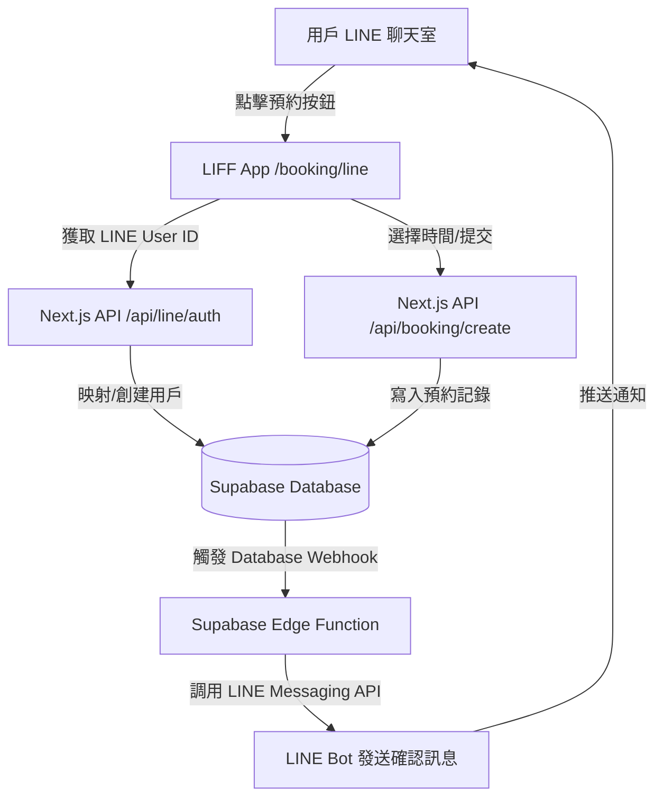

# LINE 預約系統開發規劃書 (LINE Booking System Plan)

## 1. 核心戰略 (Executive Summary)
**目標**：將 LINE 作為流量入口與通知渠道，利用 LIFF 提供視覺化預約體驗，確保預約數據與現有 Tour Platform (Next.js + Supabase) 100% 同步。
**核心邏輯**：`LINE Bot (入口)` $\rightarrow$ `LIFF App (操作)` $\rightarrow$ `Supabase (數據中心)` $\rightarrow$ `LINE Bot (通知)`。
**關鍵 KPI**：預約流程完成率提升、降低手動確認成本、提升用戶回訪率。

---

## 2. 系統架構 (System Architecture)

### 2.1 數據流向圖

### 2.2 技術棧 (Tech Stack)
- **前端**：Next.js (App Router), Tailwind CSS, LIFF SDK
- **後端**：Next.js API Routes, Supabase Edge Functions
- **數據庫**：Supabase (PostgreSQL)
- **API**：LINE Messaging API, LINE LIFF API

---

## 3. 用戶旅程 (User Journey Map)

| 階段 | 用戶行為 | 系統反應 | 交付物/觸發點 |
| :--- | :--- | :--- | :--- |
| **進入** | 在 LINE 看到預約按鈕或輸入關鍵字 | 發送 LIFF 連結按鈕 | Messaging API $\rightarrow$ Flex Message |
| **身份驗證** | 點擊按鈕開啟 LIFF 頁面 | 自動獲取 `liff.getProfile()` $\rightarrow$ 綁定 Supabase 用戶 | `/api/line/auth` |
| **選擇預約** | 在日曆中選擇日期 $\rightarrow$ 選擇時段 $\rightarrow$ 填寫需求 | 實時校驗時段可用性 (Availability Check) | LIFF Frontend $\rightarrow$ Supabase |
| **提交確認** | 點擊「確認預約」 | 寫入 `bookings` 表 $\rightarrow$ 返回成功狀態 | `/api/booking/create` |
| **反饋通知** | 回到 LINE 聊天室 | 收到精美的預約確認卡片 (包含預約詳情與取消連結) | Messaging API $\rightarrow$ Push Message |

---

## 4. 數據庫 Schema 變更 (Database Design)

### 4.1 新增 `line_user_mapping` 表
用於將 LINE 的唯一標識與平台用戶 ID 綁定。

| 欄位名 | 類型 | 描述 | 索引 |
| :--- | :--- | :--- | :--- |
| `id` | uuid (PK) | 記錄 ID | - |
| `line_user_id` | text (Unique) | LINE 提供之唯一 User ID | Unique Index |
| `user_id` | uuid (FK) | 映射至 `profiles` 表的用戶 ID | Index |
| `created_at` | timestamp | 綁定時間 | - |

### 4.2 `bookings` 表擴展
增加 LINE 渠道標記，以便追蹤轉化率。

| 欄位名 | 類型 | 描述 |
| :--- | :--- | :--- |
| `channel` | text | 'web' 或 'line' |
| `line_message_id` | text | 對應的 LINE 確認訊息 ID (用於後續追蹤) |

---

## 5. API 路由定義 (API Specifications)

### 5.1 `/api/line/auth` (POST)
- **功能**：LIFF 登錄與身份映射。
- **輸入**：`idToken` (from LIFF)。
- **輸出**：`platform_user_id` 及 `session_token`。

### 5.2 `/api/line/webhook` (POST)
- **功能**：處理 LINE Bot 的事件 (Message, Postback)。
- **輸入**：LINE Platform Webhook Payload。
- **輸出**：HTTP 200 OK。

### 5.3 `/api/booking/create` (POST)
- **功能**：提交預約請求。
- **輸入**：`userId`, `slotId`, `details`。
- **輸出**：`bookingId` 及成功狀態。

---

## 6. 實作里程碑 (Milestones)

### Phase 1: 基礎設施搭建 (Week 1)
- [ ] 註冊 LINE Developers 帳號 $\rightarrow$ 創建 Provider $\rightarrow$ 創建 Channel (Messaging API & LIFF)。
- [ ] 在 Next.js 中集成 `@line/bot-sdk` 與 LIFF SDK。
- [ ] 建立 `line_user_mapping` 表。

### Phase 2: 身份驗證與 LIFF 頁面 (Week 2)
- [ ] 實作 `/api/line/auth` 映射邏輯。
- [ ] 開發 `/booking/line` 視覺化預約頁面 (日曆 $\rightarrow$ 時段選擇)。
- [ ] 實現 LIFF 端的身份自動登錄。

### Phase 3: 預約流與通知閉環 (Week 3)
- [ ] 對接 `/api/booking/create` 與 Supabase。
- [ ] 實作 Supabase Edge Function $\rightarrow$ LINE Messaging API 的通知推送。
- [ ] 設計並實作 Flex Message 確認卡片。

### Phase 4: 測試與優化 (Week 4)
- [ ] 邊界測試：重複預約、時段衝突、取消預約流。
- [ ] UX 優化：減少點擊次數、提升頁面加載速度。
- [ ] 部署至 Production 環境。

---

## 7. 風險與解決方案 (Risk Management)

| 風險 | 影響 | 解決方案 |
| :--- | :--- | :--- |
| **LINE API 額度限制** | 通知發不出 | 使用 `replyToken` 盡量回覆而非主動 Push；監控發送量。 |
| **用戶未綁定帳號** | 無法追蹤數據 | 在 LIFF 首次進入時強制引導完成簡單的 Profile 綁定。 |
| **時區同步問題** | 預約時間出錯 | 所有存儲時間統一使用 UTC，前端根據 LINE 用戶時區轉換。 |
| **Webhook 延遲/丟失** | 用戶沒收到通知 | 實作冪等性處理 $\rightarrow$ 若通知失敗，在用戶下次開啟 LIFF 時補發通知。 |
